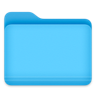

<div align="center">



# DockFolders

**Atalhos para suas pastas de projeto, direto do Dock do macOS.**

Clique no ícone do Dock, escolha a pasta e abra no Finder, no Terminal, no Xcode, no
VS Code — ou em qualquer outro app — com um clique.

🌐 **Site:** [dockfolders.vercel.app](https://dockfolders.vercel.app/)


</div>

<!-- TODO: adicionar um screenshot ou GIF do balão aberto, ex.: docs/screenshot.png -->

## Sumário

- [Visão geral](#visão-geral)
- [Funcionalidades](#funcionalidades)
- [Requisitos](#requisitos)
- [Instalação](#instalação)
- [Uso](#uso)
- [Permissões](#permissões)
- [Dados e privacidade](#dados-e-privacidade)
- [Desenvolvimento](#desenvolvimento)
- [Limitações conhecidas](#limitações-conhecidas)
- [Contribuindo](#contribuindo)
- [Licença](#licença)

## Visão geral

O DockFolders é um app nativo para macOS, escrito em Swift e AppKit, sem
dependências externas. Ele fica no Dock e, ao ser clicado, abre um balão ancorado
ao ícone com suas pastas de projeto — soltas ou organizadas em grupos.

Cada pasta tem uma lista própria de **aberturas**: os aplicativos com que ela pode
ser aberta. Uma abertura pode apontar para a pasta inteira ou para um arquivo
específico dentro dela (por exemplo, o `.xcworkspace` para o Xcode), e a abertura
do Terminal pode executar um comando assim que entra na pasta (por exemplo,
`claude` ou `npm run dev`).

## Funcionalidades

- **Acesso pelo Dock** — um clique no ícone abre o balão; clicar de novo, clicar
  fora ou pressionar `Esc` fecha.
- **Pastas e grupos** — pastas soltas no topo e grupos de projeto abaixo. Um grupo
  reúne pastas relacionadas, como o app iOS, o app Android e o backend de um mesmo
  produto.
- **Accordion exclusivo** — abrir um grupo fecha os demais, então o balão nunca
  precisa de barra de rolagem.
- **Múltiplas aberturas por pasta** — clicar no nome usa a abertura principal;
  passar o mouse sobre a pasta mostra todas as aberturas disponíveis.
- **Arquivo específico** — uma abertura pode mirar um arquivo dentro da pasta em vez
  da pasta inteira.
- **Terminal com comando** — abre o Terminal já na pasta e, opcionalmente, executa
  um comando.
- **Arrastar e soltar** — reorganize pastas entre grupos e reordene aberturas
  arrastando. Pairar sobre um grupo fechado o expande automaticamente
  (spring-loading, como no Finder).
- **Abrir tudo** — abre todas as pastas de um grupo de uma vez, cada uma com sua
  abertura principal.
- **Grupo recente no topo** — ao reabrir o balão, o último grupo usado sobe para o
  topo da lista.
- **Protegido em compartilhamento de tela** — o conteúdo do balão não aparece em
  chamadas do Meet ou do Teams nem em gravações de tela.
- **Iniciar com o sistema** — opção para abrir o app automaticamente no login.

## Requisitos

- macOS 13 Ventura ou mais recente (desenvolvido e testado no macOS 26)
- Para compilar: Xcode ou Command Line Tools da Apple (`xcode-select --install`)

## Instalação

### Pelo instalador (`.dmg`)

1. Baixe o `DockFolders-<versão>.dmg` na página de
   [Releases](https://github.com/alvesdiego18/dockfolders/releases).
2. Abra o `.dmg` e arraste o `DockFolders.app` para a pasta **Applications**.
3. Na primeira abertura, libere o app no Gatekeeper (veja abaixo).
4. Com o app aberto, clique com o botão direito no ícone do Dock →
   **Opções → Manter no Dock**.

> [!IMPORTANT]
> O app é assinado apenas localmente (ad-hoc), sem Developer ID nem notarização da
> Apple. Por isso o macOS avisa que o desenvolvedor não pôde ser verificado na
> primeira abertura — isso é esperado e não indica um app corrompido. Para liberar:
>
> - clique com o botão direito em `DockFolders.app` → **Abrir** → **Abrir**; ou
> - vá em **Ajustes do Sistema → Privacidade e Segurança** e clique em
>   **Abrir Mesmo Assim** no aviso sobre o DockFolders.
>
> Se preferir não confiar em um binário pronto, compile a partir do código-fonte.

### A partir do código-fonte

```bash
git clone https://github.com/alvesdiego18/dockfolders.git
cd dockfolders
./DockFolders/build.sh
```

O script gera:

| Artefato | Descrição |
|---|---|
| `DockFolders/dist/DockFolders.app` | Build de release |
| `DockFolders/dist/DockFolders-<versão>.dmg` | Instalador pronto para outro Mac |

Depois, mova o `.app` para `/Applications` e fixe o ícone no Dock.

## Uso

| Ação | Como fazer |
|---|---|
| Adicionar uma pasta | Botão `+` no rodapé → **Adicionar pasta…** |
| Criar um grupo | `+` → **Criar grupo…** e arraste pastas para dentro dele |
| Abrir com a abertura principal | Clique no nome da pasta |
| Abrir com outro app | Passe o mouse sobre a pasta e clique no ícone do app |
| Vincular um novo app | Nas aberturas da pasta, clique no botão `+` |
| Definir a abertura principal | Arraste o ícone do app para a primeira posição |
| Mirar um arquivo específico | Botão direito no ícone do app → **Selecionar arquivo específico…** |
| Configurar o comando do Terminal | Botão direito no ícone do Terminal → **Configurar comando…** |
| Manter o balão aberto | Segure `⌘` ao clicar |
| Abrir todas as pastas de um grupo | Botão à direita do cabeçalho do grupo |
| Renomear um grupo | Duplo clique no nome ou menu de contexto do cabeçalho |
| Remover uma pasta ou tirá-la do grupo | Botão direito na pasta |

Novas pastas começam com duas aberturas: **Finder** (principal) e **Terminal**.

## Permissões

Todas as permissões são opcionais; o app funciona sem elas, com recursos reduzidos.

| Permissão | Para quê | Sem ela |
|---|---|---|
| **Acessibilidade** | Localizar o ícone no Dock e apontar a seta do balão para ele | O balão é posicionado de forma aproximada, sem seta |
| **Automação → Terminal** | Executar o comando configurado ao abrir o Terminal | O Terminal com comando não abre |

A permissão de Acessibilidade pode ser concedida pelo aviso
"posicionamento aproximado" no rodapé do balão, ou em **Ajustes do Sistema →
Privacidade e Segurança → Acessibilidade**. A de Automação é solicitada pelo macOS
na primeira vez que uma abertura de Terminal com comando é usada.

## Dados e privacidade

O DockFolders não faz conexões de rede nem coleta dados. A configuração fica em um
único arquivo JSON local:

```
~/Library/Application Support/DockFolders/folders.json
```

O arquivo é legível e pode ser editado à mão. Se estiver corrompido, o app o
preserva como `folders.json.corrupt-<timestamp>` e recomeça com a lista vazia, sem
sobrescrever o original.

## Desenvolvimento

O projeto não usa Xcode project nem Swift Package Manager: os fontes são
compilados diretamente com `swiftc` pelo `build.sh`.

### Build

```bash
# Build de desenvolvimento (sem .dmg; balão capturável em screenshots)
DEBUG=1 ./DockFolders/build.sh
open DockFolders/dist/DockFolders.app

# Build de release com versão definida sem prompt (útil em CI)
VERSION=1.2 ./DockFolders/build.sh
```

A cada build o script pergunta a versão, sugerindo a atual de
`DockFolders/VERSION`. O valor escolhido é gravado de volta nesse arquivo e usado
no `Info.plist` e no nome do `.dmg`.

> [!NOTE]
> Apenas o build com `DEBUG=1` permite capturar o balão em screenshots. O build de
> release sempre o oculta de capturas e compartilhamentos de tela.

### Testes

Os testes cobrem o modelo de dados (`Store`): regras estruturais, persistência e
migração.

```bash
swiftc -O DockFolders/Sources/Store.swift DockFolders/Tests/main.swift -o /tmp/dockfolders-tests
/tmp/dockfolders-tests
```

### Estrutura do projeto

```
DockFolders/
├── Sources/
│   ├── main.swift              # Ciclo de vida do app, menus, login item
│   ├── Store.swift             # Modelo de dados e persistência em JSON
│   ├── BalloonPanel.swift      # Janela do balão: forma, seta, ancoragem, sharingType
│   ├── BalloonContent.swift    # Conteúdo do balão, drag & drop, menus de contexto
│   ├── Rows.swift              # Linhas de pasta e cabeçalhos de grupo
│   ├── FolderDetailView.swift  # Popover de aberturas de uma pasta
│   ├── Opening.swift           # Abertura de pastas com apps; resolução de ícones
│   └── DockTileLocator.swift   # Localiza o ícone no Dock via Accessibility API
├── Tests/
│   └── main.swift              # Testes do Store
├── Resources/
│   └── AppIcon.icns
├── VERSION
└── build.sh
```

As decisões de design — incluindo medições empíricas do posicionamento no Dock e
do comportamento de `sharingType`, e os riscos aceitos — estão documentadas em
[`CONTEXT.md`](CONTEXT.md).

## Limitações conhecidas

| Situação | Comportamento |
|---|---|
| Pasta renomeada ou movida | O item fica esmaecido e deixa de ser clicável |
| Volume externo desconectado | As pastas nele ficam esmaecidas, sem indicar a causa |
| Atualização do macOS altera a árvore de Acessibilidade do Dock | O app volta ao posicionamento aproximado, sem seta |
| App de uma abertura foi desinstalado | A abertura recorre ao Finder |
| Release sem Developer ID e sem notarização | O Gatekeeper avisa na primeira abertura |
| Interface | Disponível apenas em português |

## Contribuindo

Contribuições são bem-vindas.

1. Abra uma [issue](https://github.com/alvesdiego18/dockfolders/issues) descrevendo
   o bug ou a proposta antes de mudanças grandes.
2. Faça um fork e crie um branch a partir de `main`.
3. Se alterar o `Store.swift`, rode os testes.
4. Confira a mudança com um build `DEBUG=1`.
5. Abra um pull request explicando o que mudou e por quê.

## Licença

Distribuído sob a licença descrita em [`LICENSE`](LICENSE).
